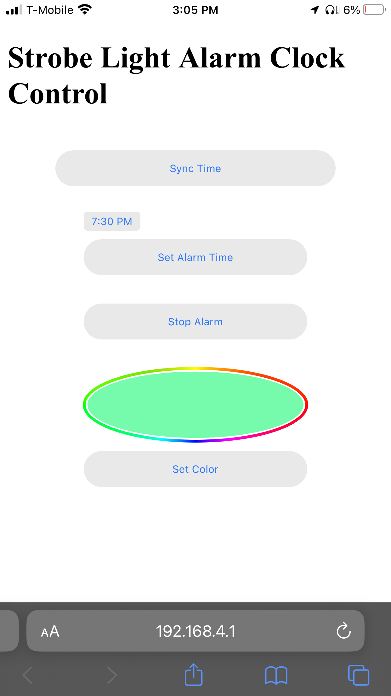

# Strobe Light Alarm Clock Version 2
### An iteration on my [previous strobe light alarm clock (SLAC)](https://github.com/Bag132/Arduino-Alarm-Clock-Strobe-Light).

This project uses an Inland ESP32-WROOM-32, DS1307 Real-time clock, LCD1602 (HD44780) LCD screen (with PCF8574 I2C backpack), and a PWM-controlled LED light strip with a couple of NPN transistors.

To control it day-to-day the ESP32 acts as an access point and opens a web page that has several functions in it like syncing the RTC's time, setting the alarm time, setting LED strip color, and stopping the alarm.

Most of this stuff has been pretty hastily written so don't expect the most amazing code practice, error handling, or robustness, I just wanted it to do some basic stuff with it lol.

